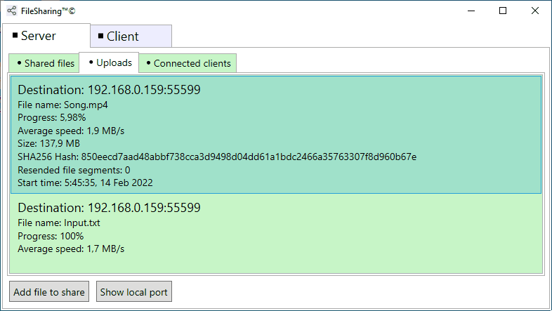
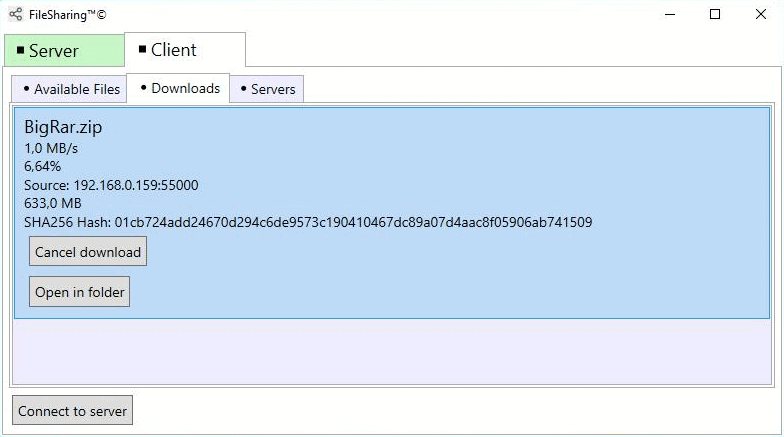

# File-Sharing
WPF-MVVM app for sharing any files between computers.
## What implemented in this project:
* Peer-to-peer architecture (each app acts both as client and as server)
* File server (shares files from local disks and storages to remote clients)
* File client (connects to file servers, downloads desired files)
* Each client-server connection is wrapped in ECDH + AES-256 encryption scheme and each message is signed with ECDSA
* File segments are compressed using gzip when transmitted
* User is able to specify port for local file server
* User is able to see current and previous downloads/uploads
* The app can be hidden in system tray
* Drag'n'drop support for shared files
## ⚠ Warning
Encryption scheme implemented in this project may be vulnerable to various attacks such as MITM, replay attack, etc.\
This app may be not a very good option for sending sensetive data across untrusted networks. It was created purely in education purposes.
## Demonstration:

## Libraries used in this project:
* [LiteNetLib](https://github.com/RevenantX/LiteNetLib)
* [Newtonsoft.Json](https://www.newtonsoft.com/json)
* [SystemTrayApp.WPF](https://github.com/fujieda/SystemTrayApp.WPF/)
* [Microsoft.Tookit.Mvvm](https://github.com/CommunityToolkit/WindowsCommunityToolkit)
* [Microsoft.Xaml.Behaviours.Wpf](https://github.com/Microsoft/XamlBehaviorsWpf)
