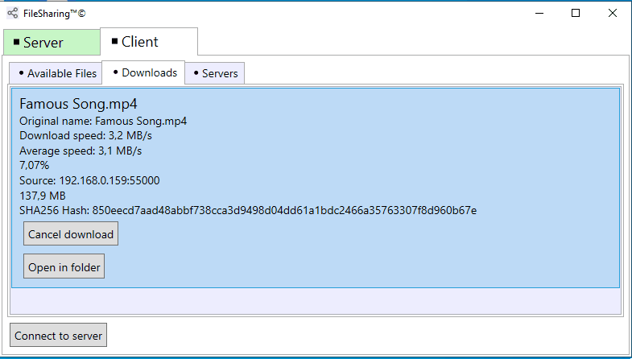

# File-Sharing
WPF-MVVM app for sharing any files between computers.
## What implemented in this project:
* Peer-to-peer architecture (each instance acts both as client and server)
* File server (shares files from local storage to remote clients)
* File client (connects to file servers, downloads desired files)
* Each client-server connection is encrypted by ECDH + AES-256 encryption scheme and each message is signed with ECDSA
* Each file segment has CRC32 checksum which is checked upon receipt
* File segments are compressed using gzip when transmitted
* User is able to see current and previous downloads/uploads
* The app can be hidden in system tray
* User is able to specify port for local file server
* The app checks if some of file segments didn't reach the client and automatically sends requests for missing segments
## ⚠ Warning
Encryption scheme implemented in this project may be vulnerable to various attacks such as MITM, replay attack, etc.\
This app may be not a very good option for sending sensetive data across Internet because it was created purely in education purposes.
## Demonstration:

## Dependencies:
* [LiteNetLib](https://github.com/RevenantX/LiteNetLib)
* [Newtonsoft.Json](https://www.newtonsoft.com/json)
* [Crc32.NET](https://github.com/force-net/Crc32.NET)
* [SystemTrayApp.WPF](https://github.com/fujieda/SystemTrayApp.WPF/)
* [Microsoft.Tookit.Mvvm](https://github.com/CommunityToolkit/WindowsCommunityToolkit)
* [Microsoft.Xaml.Behaviours.Wpf](https://github.com/Microsoft/XamlBehaviorsWpf)
* [Microsoft-WindowsAPICodePack-Shell](https://github.com/contre/Windows-API-Code-Pack-1.1)
